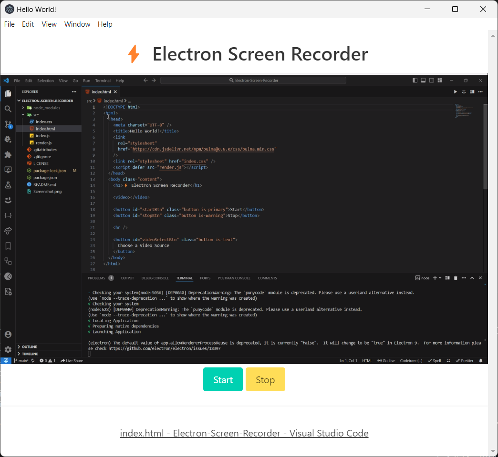

# 📹 Screen Recorder



## Overview

A versatile desktop screen recorder built with **Electron.js**.  
The application allows users to select a specific screen, window, or stream to record. It is compatible with **macOS, Windows, and Linux**, making it easy to capture screen activity across platforms.

## Setup

To run the Screen Recorder locally:

1. Navigate to the project folder:

   ```bash
   cd "Screen Recorder"
   ```

2. Install dependencies:

   ```bash
   npm install
   ```

3. Start the app:

   ```bash
   npm start
   ```

4. Reload the app state:

   ```bash
   rs
   ```

5. Build the application:

   ```bash
   npm run make
   ```

## Packaging

There are multiple ways to package Electron apps.
[Eelectron Forge](https://www.electronforge.io/) is recommended, though packaging is not implemented in this project.

## Developer Mode

* When `NODE_ENV=development`, DevTools are enabled and open by default.
* When `NODE_ENV=production`, DevTools are disabled.
