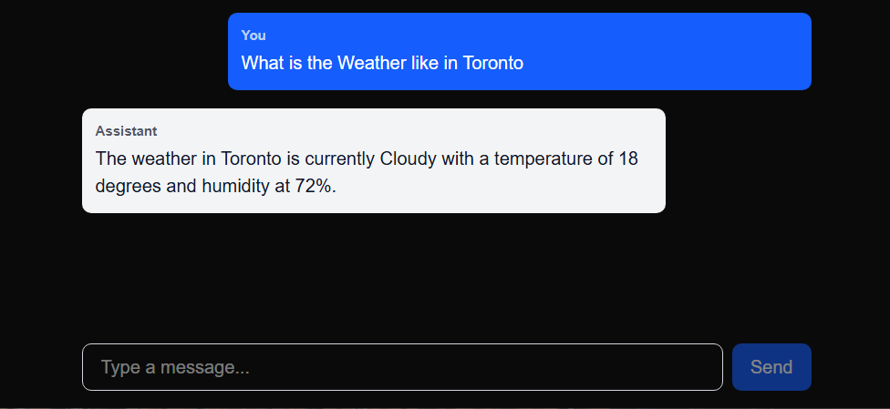

# Vercel-AI-Chat



A streaming chat app built with Next.js 16, the Vercel AI SDK v6, and a local Ollama model. Demonstrates `useChat`, streaming API routes, and tool calling — all running locally with no paid API keys.

---

## What This Project Covers

- Streaming chat UI via the `useChat` hook (`@ai-sdk/react`)
- Streaming API route using `streamText` and `toUIMessageStreamResponse`
- Message format conversion between UI and model formats (`convertToModelMessages`)
- Tool calling: the model invokes a function in your code, gets the result, and replies naturally
- Local Ollama models via the OpenAI-compatible provider (`@ai-sdk/openai` pointed at `localhost:11434`)

---

## Stack

| Layer | Package | Purpose |
|---|---|---|
| Framework | `next` 16 | App Router, API routes |
| AI SDK core | `ai` v6 | `streamText`, `tool`, `convertToModelMessages` |
| AI SDK UI | `@ai-sdk/react` | `useChat` hook |
| Provider | `@ai-sdk/openai` | Talks to Ollama via OpenAI-compatible endpoint |
| Schema | `zod` | Tool parameter validation |
| Local model | Ollama | Runs the LLM locally |

---

## Prerequisites

1. [Node.js](https://nodejs.org/) v18+
2. [Ollama](https://ollama.com/) installed and running
3. A model pulled in Ollama:
   ```bash
   ollama pull qwen2.5-coder:7b
   ```

---

## Getting Started

```bash
# Install dependencies
npm install

# Start Ollama (in a separate terminal)
ollama serve

# Run the dev server
npm run dev
```

Open [http://localhost:3000](http://localhost:3000) and start chatting.

---

## Project Structure

```
vercel-ai-chat/
├── app/
│   ├── page.tsx              # Chat UI — useChat hook, message rendering
│   └── api/
│       └── chat/
│           └── route.ts      # Streaming API route — streamText + tool definitions
└── package.json
```

---

## How It Works

### Frontend (`app/page.tsx`)

Uses `useChat` from `@ai-sdk/react`. Key points:

- In AI SDK v6, `useChat` removed built-in input state — manage it with `useState`
- Submit messages with `sendMessage({ text: input })` instead of `handleSubmit`
- Track loading state via `status === 'submitted' || status === 'streaming'`
- Messages have a `parts` array (not a plain `content` string), so render with `message.parts.map(...)`

```tsx
const [input, setInput] = useState('');
const { messages, sendMessage, status } = useChat();
const isLoading = status === 'submitted' || status === 'streaming';

sendMessage({ text: input }); // send a message
```

### Backend (`app/api/chat/route.ts`)

Key points:

- `@ai-sdk/openai` can target Ollama by setting `baseURL: 'http://localhost:11434/v1'` — Ollama implements the OpenAI-compatible API
- `streamText` must **not** be awaited — it returns a stream controller immediately
- `convertToModelMessages` converts UI-format messages (parts arrays) into model-format messages (content strings) — use this instead of manual mapping
- `toUIMessageStreamResponse()` returns a streaming HTTP response the `useChat` hook understands

```typescript
const result = streamText({
  model: ollama('qwen2.5-coder:7b'),
  messages: await convertToModelMessages(messages),
  tools: { ... },
  stopWhen: stepCountIs(3),
});
return result.toUIMessageStreamResponse();
```

### Tool Calling

Tools are defined in the `tools` object passed to `streamText`. Each tool has three parts:

```typescript
get_weather: tool({
  description: 'Get the current weather for a given city', // model reads this to decide when to call it
  inputSchema: z.object({
    location: z.string().describe('The city name, e.g. Toronto'),
  }),
  execute: async ({ location }) => {
    // your code runs here — call an API, query a DB, anything
    return { temperature: 18, condition: 'Cloudy' };
  },
}),
```

The full cycle:
```
User asks about weather
  → model decides to call get_weather("Toronto")
  → execute() runs, returns data
  → model reads result, writes natural reply
  → streams back to user
```

`stopWhen: stepCountIs(3)` allows up to 3 steps (model → tool → model), which is required for the model to respond after receiving tool results.

---

## Key AI SDK v6 Gotchas

These tripped us up during development — saving them here for reference.

| Old API (v3/v4) | New API (v6) | Notes |
|---|---|---|
| `import { useChat } from 'ai/react'` | `import { useChat } from '@ai-sdk/react'` | Separate package |
| `handleSubmit`, `handleInputChange` | `sendMessage({ text })` + manual `useState` | useChat no longer manages input |
| `isLoading` | `status === 'submitted' \| 'streaming'` | More granular status |
| `parameters: z.object(...)` | `inputSchema: z.object(...)` | Tool schema key renamed |
| `maxSteps: 3` | `stopWhen: stepCountIs(3)` | More expressive stop condition |
| `toDataStreamResponse()` | `toUIMessageStreamResponse()` | Method renamed |
| `await streamText(...)` | `streamText(...)` (no await) | Awaiting it blocks streaming |
| Manual message mapping | `convertToModelMessages(messages)` | Built-in SDK utility |

---

## Switching to a Real Provider

The provider is the only thing that changes. Everything else — tools, UI, message conversion — stays identical.

```typescript
// Current: Ollama (local, free)
import { createOpenAI } from '@ai-sdk/openai';
const ollama = createOpenAI({ baseURL: 'http://localhost:11434/v1', apiKey: 'ollama' });
model: ollama('qwen2.5-coder:7b')

// Switch to Anthropic
import { anthropic } from '@ai-sdk/anthropic';
model: anthropic('claude-sonnet-4-6')

// Switch to OpenAI
import { openai } from '@ai-sdk/openai';
model: openai('gpt-4o')
```

Add the API key to `.env.local`:
```
ANTHROPIC_API_KEY=your_key_here
# or
OPENAI_API_KEY=your_key_here
```

---

## Extending the Weather Tool

To replace the mock data with a real weather API (Open-Meteo is free, no key needed):

```typescript
execute: async ({ location }) => {
  const geo = await fetch(`https://geocoding-api.open-meteo.com/v1/search?name=${location}&count=1`);
  const { results } = await geo.json();
  const { latitude, longitude } = results[0];

  const weather = await fetch(
    `https://api.open-meteo.com/v1/forecast?latitude=${latitude}&longitude=${longitude}&current=temperature_2m,weathercode`
  );
  const data = await weather.json();
  return { location, temperature: data.current.temperature_2m };
}
```

---

## Adding More Tools

Add additional tools to the `tools` object — the model will pick whichever is appropriate:

```typescript
tools: {
  get_weather: tool({ ... }),
  calculate: tool({
    description: 'Evaluate a mathematical expression',
    inputSchema: z.object({ expression: z.string() }),
    execute: async ({ expression }) => ({ result: eval(expression) }),
  }),
}
```