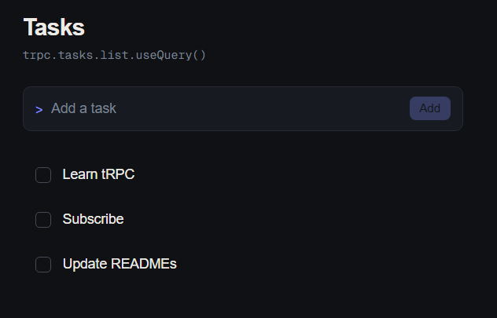

# Trpc-Hono-Frontend



A minimal Next.js (App Router) client demonstrating end-to-end type inference from the [tRPC backend](../README.md) one level up. This exists to prove the client side of the stack works, not as a project in its own right — see the root README for the actual API reference, auth model, and what this whole learning project covers.

## What's here

- `app/_trpc/client.ts` — creates the typed `trpc` object via `createTRPCReact<AppRouter>()`, importing the `AppRouter` **type only** from `../src/trpc/router.ts` in the backend. No backend code runs here; only the shape is imported.
- `app/_trpc/config.ts` — single source of truth for the backend URL (`http://localhost:3000`). Both the tRPC client and the REST auth calls read from here.
- `app/_trpc/auth.ts` — reads/writes the JWT to `localStorage`, and includes a `decodeEmailForDisplay()` helper that decodes a JWT's payload **without verifying its signature**, purely to show "logged in as <x@y.com>" in the UI. This is safe for display only — a JWT's payload is base64-encoded, not encrypted, so anyone can read it whether or not it's valid. The actual security check happens server-side in the backend's `verifyToken()`; nothing on the client is trusted for access control.
- `app/_trpc/Provider.tsx` — wires up `@trpc/react-query` and `@tanstack/react-query`. On every request, `headers()` reads the current token fresh from `localStorage` via `getToken()`, so logging in or out takes effect on the very next request without recreating the tRPC client.
- `app/login/page.tsx` — a combined login/register form that calls the backend's REST `POST /auth/login` and `POST /auth/register` directly (these stayed REST endpoints on the backend; only `/tasks/*` was migrated to tRPC). On success, stores the returned token and redirects to `/`.
- `app/page.tsx` — the task list. Redirects to `/login` if no token is present, shows who's logged in, and offers a logout button. Uses `trpc.tasks.list.useQuery()` plus `create` / `update` / `delete` mutations with optimistic updates.

## Running it

1. Make sure the backend is running first — see the [root README](../README.md#local-setup). It must be on `http://localhost:3000` and `ALLOWED_ORIGINS` must include this app's dev URL (`http://localhost:3001` by default).
2. Install and run:

```bash
   npm install
   npm run dev
```

1. Open the printed local URL (Next.js will pick `3001` automatically since `3000` is taken by the backend). You'll be redirected to `/login` — register a new account there to get started.

## Auth flow

Unlike an earlier version of this app (which hardcoded a JWT in `Provider.tsx` for demo purposes), this app now has a real, if minimal, login flow:

1. `/login` calls `POST /auth/register` or `POST /auth/login` on the backend and stores the returned JWT in `localStorage`
2. `Provider.tsx` attaches that token as `Authorization: Bearer <token>` on every tRPC request
3. `page.tsx` checks for a token on mount and redirects to `/login` if there isn't one, so you never see a flash of another user's-shaped empty state before being sent to log in

### Testing multi-user isolation locally

Because `localStorage` is shared across tabs of the same browser, testing "two different logged-in users" requires two separate storage contexts — for example, one normal window and one incognito/private window (or two different browsers entirely). Register a different user in each, add tasks in both, and confirm neither sees the other's tasks. The backend now scopes every task query by the authenticated user's id, so this should hold even if you know another user's task id and try to update/delete it directly — you'll get a `404`, indistinguishable from a task that doesn't exist at all.

## Why the relative type import works

This app lives *inside* the backend repo (`trpc-hono-practice/trpc-frontend/`) rather than as a separate project, specifically so `app/_trpc/client.ts` can do:

```ts
import type { AppRouter } from '../../../src/trpc/router'
```

with no workspace tooling, package publishing, or monorepo setup required — just a relative path crossing into the sibling backend folder. That's a fine pattern for a learning project or small internal tool; a larger real-world split-repo setup would typically publish the router type as its own package instead.
