# 🏔️ Framework Mountain

**Framework Mountain** is a curated collection of web development projects organized into themed **Valleys**. Each Valley represents a focused area of exploration such as UI components, creative experiments, full web apps, backend systems, games, portfolios, and data scraping.

All projects are **self-contained**, framework-diverse, and built for hands-on learning.

---

## 🗺️ Valley Overview

- 🧠 **Backend Valley** — Backend & full-stack foundations
- 🧩 **Component Valley** — Reusable UI components
- 🕷️ **Data Scrape Valley** — Web scraping & automation
- 🎮 **Game Valley** — Browser-based games
- 🌌 **Portfolio Valley** — Portfolio & personal showcase sites
- 🔬 **Tech Experiments** — Tooling, CI/CD pipelines, and developer workflow setups
- 🕸️ **App Valley** — Full web & desktop applications and clones

---

## 🧠 Backend Valley

<div align="center">
  
  
  
</div>

### Projects

- **FastAPI**  
  A modern Next.js-based project integrating backend concepts and API configuration, structured for scalable full-stack development.

- **Hono Practice**  
  REST API covering routing, validation, HTTPS security, auth middleware, tRPC, Next.js Frontend, Prisma + Supabase database integration (or Docker/PostgreSQL for local), and Vitest testing.

- **Redis Learning**  
  Learning and experimentation with Redis, a distributed in-memory key-value store.

- **Hackathon-Nestjs-Backend**  
  A scalable API built with NestJS and Agentic Coding for managing hackathons

**Tech:** Next.js, TypeScript, PostCSS, pnpm, Hono, Prisma, Supabase, Zod, Vitest, Redis, IoRedis, Docker, NestJS

---

## 🧩 Component Valley

<div align="center">
  
  
  
</div>

### Projects

- **Animated CSS Login Form**  
  Animated login form built with Svelte and Rollup.

- **Pay Card Component**  
  Interactive credit card form with live preview and theming.

- **Vuetify Image Gallery**  
  Responsive image gallery with sidebar navigation.

**Tech:** Svelte, React, Vue 2, Vuetify, SCSS, Rollup

---

## 🕷️ Data Scrape Valley

<div align="center">
  
  
  
</div>

### Projects

- **Scrapping A Bookstore With Puppeteer**  
  Book data extraction using Puppeteer and TypeScript.

- **Scrapping Blogs With Puppeteer**  
  Blog scraping scripts with extracted JSON datasets.

- **Scrapping Dental PMS Sites With Puppeteer**  
  Advanced scraping and comparison tooling for PMS platforms.

**Tech:** Node.js, Puppeteer, TypeScript, JavaScript

---

## 🎮 Game Valley

### Flappy Bird

📁 `Game Valley/Flappy Bird`


A browser-based **Flappy Bird clone** with sound effects and sprite animations.

**Tech:** JavaScript, HTML, Canvas

---

## 🌌 Portfolio Valley

<div align="center">
  
  
  
  
  
</div>

### Projects

- **3D Solar Portfolio** — Three.js solar-system themed portfolio  
- **3D Svelte Portfolio** — CMS-driven SvelteKit portfolio with slices  
- **Black Hole** — Next.js portfolio with motion & video backgrounds  
- **Fancy Green** — Clean React + Vite portfolio concept  
- **Techno Explosion** — High-energy animated Next.js portfolio  

**Tech:** SvelteKit, React, Next.js, Tailwind CSS, Three.js

---

## 🔬 Tech Experiments

<div align="center">
  
  
  
  
  
  
  
  
</div>

### Projects

- **Sky Diving Parallax Cat**  
  Fun parallax animation experiment with layered assets.
- **Github Actions Reference** — CI/CD pipeline with type-checking, testing, linting, and Docker builds wired into GitHub Actions
- **Vitest Testing** — Unit & integration testing with Vitest
- **Nextjs OAuth** — GitHub OAuth login with Auth.js (NextAuth v5)
- **Cli-Chat** —  Terminal chat app with streaming responses, role-based history, and persistent conversations for Ollama and Anthropic.
- **Rag-Demo** —  A from-scratch implementation of Retrieval-Augmented Generation (RAG) using Ollama, Docker, Postgres, PGVector, and Python
- **Bull-MQ-Demo** —  A from-scratch implementation of a production-ready email queue system using BullMQ, Docker, Redis, and JavaScript
- **Pino-Demo** — Compared Using `console.log` and `pino`
- **Git-Practice** — Practiced Git Merge/Rebase Strategies and Conflicts
- **Webhook-Demo** — Received and verified webhooks using Stripe CLI and HMAC-SHA256 signature verification
- **My MCP Server** — A simple Model Context Protocol (MCP) server built with TypeScript, Node.js, Zod and MCP SDK.
- **Bots-And-Hooks** — A practice repository for learning three essential tools that keep a codebase healthy and secure: **Husky**, **Dependabot**, and **Snyk**.
- **Bun-Playground** — A hands-on learning project exploring [Bun](https://bun.sh)
- **N8N Workflows** — A hands-on learning project exploring [N8N](https://n8n.io) and automated workflows
- **LangChain-Practice** — Hands-on learning projects exploring LangChain (Built with Python and Streamlit)
- **GSAP-Practice** —  Hands-on learning exploring GSAP (Built with React, Vite, and Tailwind CSS)
- **ASCII Terminal Player** — A terminal-based video player that plays videos using **colorful ASCII art**, OpenCV, NumPy, and Python
- **OpenTelemetry-Demo** — A hands-on learning project exploring OpenTelemetry (Built with Hono and Jaeger)
- **PWA Notes** — A tiny offline-capable notes app, built to explore Progressive Web Apps.

**Tech:** React, Vite, Vitest, JavaScript, TypeScript, GitHub Actions, Docker, Next.js, Auth.js, GitHub OAuth, Ollama, Anthropic, Python, Postgres, Redis, BullMQ, Pino, Git, Stripe CLI, Node.js, MCP SDK, Zod, Husky, Dependabot, Snyk, Bun, N8N, LangChain, Streamlit, GSAP, OpenCV, NumPy, Hono, Jaeger

---

## 🕸️ App Valley

<div align="center">
  
  
  
  
  
  
  
  
  
  
  
  
  
  
</div>

### Projects

- **Angular Webshop**  
  E-commerce demo with cart services and Node.js checkout server.

- **Digital Hippo**  
  Full-featured e-commerce platform with authentication, payments, and CMS.

- **3D Apple Homepage**  
  3D product-style homepage using React and Vite with GLB models.

- **Job Board**  
  Vue-based CRUD job listing application with routing.

- **Netflix**  
  Netflix-style UI clone using API-driven rows.

- **Vercel AI Chat**
  A local, cost-free streaming chat app built with Next.js 16, Vercel AI SDK v6, OpenAI provider, and Ollama -> Demonstrates `useChat`, streaming API routes, and tool calling.

- **Job Pilot**
  AI-powered job search assistance for matching roles, tailored resumes, and faster applications.

- **Filmverse**
  A modern React movie discovery app with TMDB integration, voice-enabled navigation (Alan AI), favorites & watchlists, and light/dark mode.

- **GSAP Drinks**
  A modern drinks website built with React and TailwindCSS, featuring smooth GSAP animations such as SplitText reveals, scroll-triggered effects, parallax scrolling, and a custom carousel.

- **CaseCobra**  
  A full-stack e-commerce shop for custom phone cases. Features a drag-and-drop phone case configurator, secret admin dashboard for order management, Stripe payments, Kinde authentication, and transactional thank-you emails. Built on Next.js 14 App Router with shadcn-ui.  
  **Tech:** Next.js 14, TypeScript, PostgreSQL, Tailwind CSS, shadcn-ui, Stripe, Kinde Auth, drag-and-drop file uploads

- **Glisten AI**  
  A sleek, dark, animated marketing website in the style of Linear, Raycast, and Clerk. Features GSAP scroll and load animations, and Prismic as a headless CMS for content management.  
  **Tech:** Next.js 14, TypeScript, GSAP, Prismic (headless CMS), Tailwind CSS, Vercel

- **Modern AliExpress**  
  A full-stack e-commerce web app cloning AliExpress with a modernized UI. Includes Google and GitHub OAuth, Stripe payment integration, and a Supabase-backed PostgreSQL database managed via Prisma ORM.  
  **Tech:** Vue.js, Nuxt.js, Tailwind CSS, Prisma ORM, Supabase (PostgreSQL), Stripe, OAuth (Google, GitHub), Vercel

- **NoteMark**  
  A cross-platform desktop note-taking app with native Markdown support. Installable on Mac, Windows, and Linux.  
  **Tech:** Electron, React, TypeScript/JavaScript, Markdown, yarn

- **Screen Recorder**  
  A versatile cross-platform desktop screen recorder. Lets users select a specific screen, window, or stream to record. Compatible with macOS, Windows, and Linux.  
  **Tech:** Electron.js, JavaScript, HTML, CSS

- **Image Resizer**  
  A desktop tool for selecting an image and easily changing its width and/or height.  
  **Tech:** Electron.js, JavaScript, HTML, CSS

- **Career Flow**
  A job application tracker that tracks job applications per authenticated user, matches resume text against job postings, queues background jobs (reminders) via BullMQ, and is instrumented with OpenTelemetry so the queue and API can be traced end to end.
  **Tech:** tRPC, Prisma ORM, PostgreSQL, BullMQ, OpenTelemetry, Vitest

- **MacBook Homepage**
  Apple-style 3D website built with React, Three.js, GSAP, and TailwindCSS! Showcase products in immersive 3D scenes, scroll-animated models, and pinned sections. Featuring responsive design, smooth timeline animations, and visually striking image transitions—perfect for developers creating interactive, modern web experiences.
  **Tech:** React, Three.js, GSAP, Tailwind CSS, Vite, Zustand

**Tech:** Angular, Vue 3, React, Vite, Next.js, Tailwind CSS, Node.js, Vercel AI SDK, Ollama, OpenAI, Claude, Open Router, InsForge, PostHog, Adzuna, BrowserBase, GSAP, PostgreSQL, shadcn-ui, Stripe, Kinde Auth, Prismic, Nuxt.js, Prisma ORM, Supabase, OAuth, Electron, Markdown, yarn, tRPC, BullMQ, OpenTelemetry, vitest

---

## 🛠️ Skills Demonstrated

- **Frameworks & Platforms:** React, Svelte, SvelteKit, Vue, Angular, Next.js, Nuxt.js, Electron (desktop)
- **Styling:** Tailwind CSS, SCSS, Vuetify, CSS animations, shadcn-ui
- **Backend & Data:** Node.js, Puppeteer, API integration, PostgreSQL, Prisma ORM, Supabase
- **3D & Motion:** Three.js, asset-driven animation, GSAP
- **Auth & Payments:** Stripe, Kinde Auth, OAuth (Google, GitHub)
- **Architecture:** Component-based design, modular folders

---

## 🚀 Getting Started

Each project is self-contained.

```bash
cd Valley/Project-Name
pnpm import
pnpm install
pnpm dev
```

Refer to individual project READMEs for project-specific setup.

---

## 🗂️ Repository Structure & Git Concepts

<div align="center">
  
  
</div>

Framework Mountain is a **monorepo** — a single Git repository that houses multiple independent projects, organized into category folders called Valleys. One `.git` folder at the root tracks all of them.

### Why a Monorepo?

- One place to clone, one place to push
- Shared config (`.gitignore`, `.gitattributes`, `.vscode/`) applies across all projects
- Easy cross-referencing between projects

---

### Cloning This Repo

Some projects inside Framework Mountain are **Git Submodules** — separate repositories linked into this one by a commit pointer. A plain `git clone` will leave those folders empty.

Always clone with:

```bash
git clone --recurse-submodules https://github.com/AbdulDevHub/Framework-Mountain.git
```

If you already cloned without that flag, run:

```bash
git submodule update --init --recursive
```

---

### Git Submodules

A submodule is a pointer from this repo to a specific commit in another repo. The submodule folder exists inside Framework Mountain, but its contents are managed by the external repository. Best used for external repos you don't own or that other projects also depend on.

**Submodule projects in this repo:**

| Project | Valley | Source |
| --- | --- | --- |
| Filmverse | App Valley | [AbdulDevHub/Filmverse](https://github.com/AbdulDevHub/Filmverse) |
| CaseCobra | App Valley | [AbdulDevHub/Case-Cobra](https://github.com/AbdulDevHub/Case-Cobra) |
| Glisten AI | App Valley | [AbdulDevHub/Glisten-AI](https://github.com/AbdulDevHub/Glisten-AI) |
| Modern AliExpress | App Valley | [AbdulDevHub/Modern-AliExpress](https://github.com/AbdulDevHub/Modern-AliExpress) |
| NoteMark | App Valley | [AbdulDevHub/NoteMark](https://github.com/AbdulDevHub/NoteMark) |

**Adding a new submodule:**

```bash
git submodule add https://github.com/username/repo-name.git "Valley/Project-Name"
git commit -m "Add repo-name as submodule in Valley"
git push
```

**Updating a submodule to its latest version:**

```bash
cd "App Valley/Filmverse"
git pull origin main
cd ../..
git add "App Valley/Filmverse"
git commit -m "Update Filmverse submodule to latest"
git push
```

**Pulling submodule updates after someone else updated the pointer:**

```bash
git pull
git submodule update --recursive
```

---

### Git Subtrees

A subtree absorbs another repository's code into this repo. Unlike submodules, there is no external dependency — the code and a squashed snapshot of its history are fully merged into Framework Mountain. Best used for projects you own locally that have their own Git history.

**How it works:**

- The absorbed project's `.git` folder is removed — Framework Mountain's root `.git` takes over
- With `--squash`, all original commits are collapsed into two merge commits in the monorepo log, keeping history clean
- Branches from the original repo are not carried over — only the specified branch is pulled in

**Subtree projects in this repo:**

| Project | Valley | Original Branch |
| --- | --- | --- |
| Git-Practice | Tech Experiments | master |
| Screen Recorder | App Valley | split-screen-recorder (from Electron-Mountain) |
| Image Resizer | App Valley | split-image-resizer (from Electron-Mountain) |

**Adding a new subtree from a local project:**

```bash
# Step 1 — Register the local project as a temporary remote
git remote add Project-Name "C:\path\to\local\project"

# Step 2 — Pull its history into a subfolder
git subtree add --prefix="Valley/Project-Name" Project-Name branch-name --squash

# Step 3 — Remove the temporary remote (no longer needed)
git remote remove Project-Name

# Step 4 — Push to GitHub
git push
```

**Adding a new subtree from a GitHub repo:**

```bash
git remote add Project-Name https://github.com/username/repo-name.git
git subtree add --prefix="Valley/Project-Name" Project-Name main --squash
git remote remove Project-Name
```

**Adding subtrees from a source repo that contains multiple projects:**

A plain `subtree add` pulls in the *entire* source repo's tree at the given prefix — fine for a single-project repo, but wrong if the source repo bundles several independent projects in subfolders (each would need its own prefix). In that case, split each subfolder into its own history first, then add each split separately:

```bash
# In a local clone of the source repo
git clone https://github.com/username/multi-project-repo.git
cd multi-project-repo
git subtree split --prefix="Project-A" -b split-project-a
git subtree split --prefix="Project-B" -b split-project-b
cd ..

# Back in Framework Mountain
git remote add multi-project-repo "./multi-project-repo"   # or its GitHub URL
git fetch multi-project-repo
git subtree add --prefix="Valley/Project-A" multi-project-repo split-project-a --squash
git subtree add --prefix="Valley/Project-B" multi-project-repo split-project-b --squash
git remote remove multi-project-repo
git push
```

---

## 📌 Notes

- Focused on **learning, experimentation, and real implementations**
- Valleys group projects by **intent**, not just framework
- Clean separation between UI, apps, backend, and experiments

---

**Welcome to Framework Mountain — explore the Valleys 🏔️**
