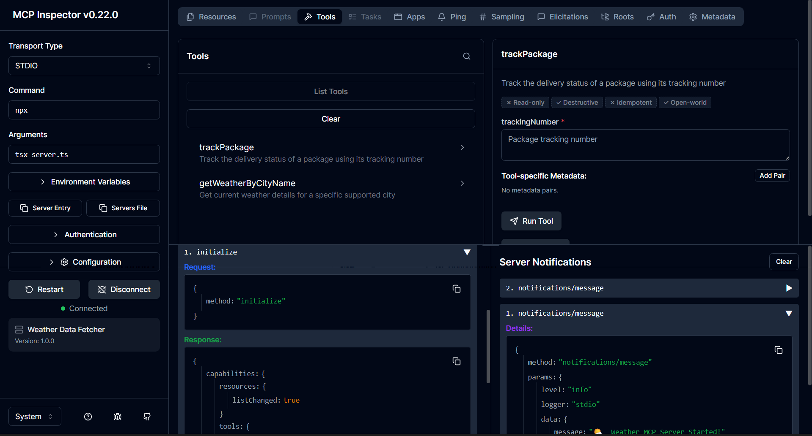

# Weather & Logistics MCP Server

A simple **Model Context Protocol (MCP)** server built with **TypeScript**, **Node.js**, and the **@modelcontextprotocol/sdk**.



This project demonstrates how to build an MCP server that exposes:

* **Tools** for weather lookup and package tracking
* **Resources** for supported cities and airport codes
* Communication over **stdio**, making it compatible with clients like Claude Desktop

---

## What is MCP?

The **Model Context Protocol (MCP)** is an open standard developed by Anthropic that enables AI assistants to securely interact with external tools, resources, and services.

MCP helps address two common limitations of LLMs:

* **Access to live or private data** through external tools and resources.
* **Limited context windows** by allowing models to request only the information they need instead of loading everything into the prompt.

MCP servers can expose three primary building blocks:

* **Tools** – Executable functions that models can call.
* **Resources** – Read-only data accessible through URI schemes.
* **Prompts** – Reusable prompt templates that help guide model behavior (not used in this example).

---

## Features

### Tools

* **trackPackage**

  * Accepts a `trackingNumber`
  * Simulates checking a package's delivery status

* **getWeatherByCityName**

  * Accepts a `city`
  * Returns simulated weather data for:

    * London
    * New York

### Resources

* **flights://airports**

  * List of supported airport codes:

    * JFK
    * LHR
    * SFO

* **weather://cities**

  * List of supported cities:

    * London
    * New York

---

## Project Structure

```text
.
├── server.ts
├── package.json
├── package-lock.json
└── Screenshot.png
```

---

## Running the Server

Install dependencies:

```bash
npm install
```

Start the MCP server:

```bash
npm start
```

---

## Testing with MCP Inspector

You can inspect and test the server using the official MCP Inspector:

```bash
npm start
npx @modelcontextprotocol/inspector@latest
```

The Inspector provides an interactive interface for testing tools, resources, and server responses during development.

IMPORTANT: See Screenshot.png for proper "Command" & "Arguments" values in the Inspector UI

---

## Claude Desktop Configuration

To use this server with Claude Desktop:

1. Open **Claude Desktop**.
2. Navigate to **Settings → Developer**.
3. Click **Edit Config File**.
4. Add your server configuration:

```json
{
  "mcpServers": {
    "weather-mcp": {
      "command": "npx",
      "args": [
        "tsx",
        "/path/to/server.ts"
      ]
    }
  }
}
```

> **Note:** On Windows, use forward slashes (`/`) or escaped backslashes (`\\`) in JSON paths.

---

## Transport

This example uses **StdioServerTransport**, which communicates over standard input and output. This is the recommended transport for local desktop clients such as Claude Desktop.

MCP also supports **Streamable HTTP Transport**, which is better suited for web applications, APIs, and cloud-hosted MCP servers.

---

## Example Tool Calls

### Weather

Input:

```json
{
  "city": "London"
}
```

Output:

```json
{
  "temp": "16°C",
  "forecast": "Rainy and overcast"
}
```

### Package Tracking

Input:

```json
{
  "trackingNumber": "ABC123456"
}
```

Output:

```text
Checking delivery status for: ABC123456
```

---

## Supported Cities

* London
* New York

## Supported Airport Codes

* JFK — New York
* LHR — London Heathrow
* SFO — San Francisco
