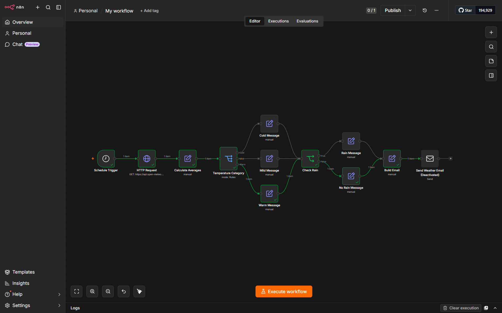

# Weather Email Workflow — n8n



Every day at **7:00 AM**, this workflow checks the day's weather forecast for
Mississauga, ON via the free [Open-Meteo](https://open-meteo.com/) API (no
API key required) and emails a hardcoded, rule-based summary — no AI involved.

Built and tested locally in n8n running via Docker.

## How it works

| Node | Type | Purpose |
|------|------|---------|
| Daily 7AM Trigger | Schedule Trigger | Fires once a day at 07:00 (America/Toronto) |
| Get Mississauga Weather | HTTP Request | Calls Open-Meteo for lat/long `43.5890, -79.6441` |
| Calculate Averages | Edit Fields | Computes `avgTemp` = (max+min)/2, extracts `precipSum`, `date` |
| Temperature Category | Switch | Routes to Cold / Mild / Warm based on `avgTemp` |
| Cold / Mild / Warm Message | Edit Fields | Sets the hardcoded jacket advice for that branch |
| Check Rain | IF | True if `precipSum > 1mm` |
| Rain / No Rain Message | Edit Fields | Sets the hardcoded rain advice |
| Build Email | Edit Fields | Combines everything into subject + body |
| Send Weather Email | Send Email (SMTP) | Sends the final email |

### Hardcoded rules

- **Temperature** (based on average of daily max/min):
  - Cold: `avgTemp < 5°C` → "wear a warm winter jacket"
  - Mild: `avgTemp < 18°C` (and already ≥5, since Cold was checked first) → "light jacket or sweater"
  - Warm: `avgTemp ≥ 18°C` → "no jacket needed"
- **Rain**: `precipSum > 1mm` → rain/umbrella message, otherwise "no rain expected"
- Email includes the actual high/low temp (°C) and precipitation amount, not just the category.

**Important n8n quirk learned while building this**: the Switch node's UI does
not support multiple conditions (AND/OR) within a single rule — that's an
IF-node-only feature. Instead, rules evaluate **top to bottom** and stop at
the first match, so the Mild rule only needs to check `avgTemp < 18`, since
the Cold rule above it has already filtered out anything below 5. Rule order
in the Switch node matters because of this.

## File in this folder

- `Weather Email Workflow.json` — your own exported copy of the finished workflow (downloaded directly from n8n).

To re-import it into a fresh n8n instance later: **⋯ (Options) → Import from File**.

---

## Part 1: Run n8n locally

1. **Install Docker Desktop** (Mac/Windows/Linux) — free download from docker.com.
2. **Launch n8n** with a named volume (so your data survives restarts) and the
   correct timezone (so "7 AM" means Mississauga time, not UTC):

   ```bash
   docker run -d --name n8n -p 5678:5678 \
     -v n8n_data:/home/node/.n8n \
     -e GENERIC_TIMEZONE="America/Toronto" \
     -e TZ="America/Toronto" \
     n8nio/n8n
   ```

   - `-d` runs it in the background (detached), so closing the terminal won't kill it.
   - `-v n8n_data:/home/node/.n8n` stores all your data (accounts, workflows,
     credentials) in a Docker-managed volume called `n8n_data`, separate from
     the container itself.
3. Open **<http://localhost:5678>** and log in with the admin account you created.

## Part 2: Stopping and restarting

Since the container was launched with `-d` and a named volume (no `--rm`),
it's safe to stop it — nothing gets deleted, and everything (workflows,
credentials, active/inactive state) picks back up exactly where you left off.

**To stop n8n** (e.g. when you're done working, or want to free up resources):

```bash
docker stop n8n
```

**Note:** if your workflow is toggled **Active**, it will *not* run while the
container is stopped — the schedule trigger only fires while n8n is actually
running. If you want the 7 AM email to keep happening automatically, leave
the container running (or start it before 7 AM each day).

**To start it again later:**

```bash
docker start n8n
```

(No need for `docker run` again — that would try to create a brand new
container. `docker start` resumes the existing one, volume and all.)

**To check if it's currently running:**

```bash
docker ps
```

**To permanently remove the container** (keeping the volume/data intact, so
you could recreate the container fresh later and still have your workflows):

```bash
docker rm n8n
```

**To delete the underlying data too** (irreversible — only do this if you
want a completely clean slate):

```bash
docker volume rm n8n_data
```

## Part 3: Save to GitHub

```bash
git init
git add "Weather Email Workflow.json" README.md
git commit -m "Mississauga daily weather email — n8n workflow"
git remote add origin <your-repo-url>
git push -u origin main
```

---

## (Optional, for later) Deploying to the cloud for free — Hugging Face Spaces

If you ever want this running 24/7 without keeping your computer on, Hugging
Face Spaces can host the same Docker container for free.

### Step 1: Create a Hugging Face account

Sign up at <https://huggingface.co/> if you don't already have an account.

### Step 2: Create a new Space

1. Click your profile picture → **New Space**.
2. Name it (e.g. `my-personal-n8n`).
3. Under **Space SDK**, choose **Docker**.
4. Under **Docker template**, choose **Blank**.
5. Set visibility to Public or Private (Private keeps your instance URL hidden;
   the free tier works either way).
6. Click **Create Space**.

### Step 3: Add a Dockerfile

1. Go to the **Files** tab → **Add file** → **Create a new file**.
2. Name it exactly `Dockerfile`.
3. Paste:

   ```dockerfile
   FROM n8nio/n8n:latest
   USER root
   ENV GENERIC_TIMEZONE="America/Toronto"
   ENV TZ="America/Toronto"
   CMD ["n8n", "start"]
   ```

4. Commit the file to `main`.

### Step 4: Access your cloud n8n

- Hugging Face builds and starts the container automatically (~1–2 min).
- Click the **App** tab once status shows **Running**.
- You'll see the same n8n setup screen — create a cloud admin account.

### Step 5: Migrate the workflow

1. In your **Hugging Face** n8n, create a new blank workflow and use
   **Import from File** to upload `Weather Email Workflow.json`.
2. Re-add the SMTP credential (credentials never transfer automatically via export/import).
3. Save and toggle the workflow **Active**.

Your workflow will then run every day at 7 AM without your computer needing
to be on.

> **Note:** Hugging Face Spaces free tier can sleep after inactivity on some
> tiers/configurations — worth double-checking current Hugging Face docs
> before relying on it for a daily trigger, since their free-tier policies
> can change.
